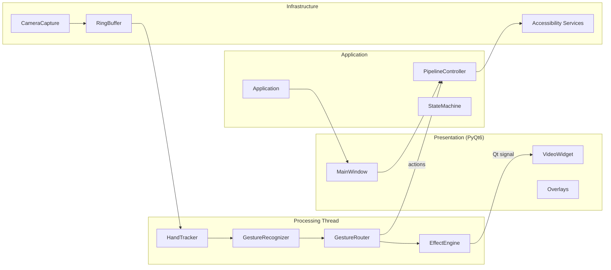

# GestureVision AI

**Version 0.1.0 · Phase 5 — Accessibility**

GestureVision AI is a real-time, gesture-controlled computer vision desktop application. It combines webcam capture, MediaPipe hand tracking, configurable visual effects, and an accessibility layer designed for users who rely primarily on audio or on-screen text rather than conventional mouse-and-keyboard interaction.

The system is implemented in Python using OpenCV, MediaPipe, and PyQt6. Behavior is driven entirely by YAML configuration files, enabling gesture mappings, effect parameters, and accessibility profiles to be modified without changing application code.

---

## Table of Contents

- [Overview](#overview)
- [Design Principles](#design-principles)
- [Development Roadmap](#development-roadmap)
- [System Architecture](#system-architecture)
- [Core Capabilities](#core-capabilities)
- [Accessibility Profiles](#accessibility-profiles)
- [Gesture and Voice Interaction](#gesture-and-voice-interaction)
- [Installation](#installation)
- [Usage](#usage)
- [Configuration Reference](#configuration-reference)
- [Project Structure](#project-structure)
- [Testing](#testing)
- [Performance](#performance)
- [Documentation](#documentation)
- [Requirements](#requirements)
- [License](#license)

---

## Overview

GestureVision AI addresses two related problems:

1. **Real-time visual interaction** — Users control a live camera feed through hand gestures: switching filters, painting on the image, revealing hidden layers, and capturing screenshots.
2. **Inclusive access** — The application provides dedicated interaction modes for users with different sensory needs:
   - **Beauty** — An audio-first profile for users who cannot see the screen. Text-to-speech (TTS) narrates every action; voice input drives music search, learning prompts, and general requests.
   - **Dandelion** — A visual-first profile for users who cannot hear audio feedback. Large on-screen captions, a touch navigation bar, and gesture menus replace spoken instructions.

At startup, the user selects a profile (or triggers Beauty mode by speaking a configured keyword). The camera pipeline then starts automatically and begins processing frames through a multi-threaded architecture that keeps the user interface responsive.

---

## Design Principles

| Principle | Description |
|-----------|-------------|
| **Configuration over code** | Gestures, effects, apps, voice commands, and profile behavior are defined in `config/*.yaml`. |
| **Modular boundaries** | Each package (`camera/`, `hand_tracking/`, `effects/`, `accessibility/`, etc.) has a single responsibility and communicates through shared contracts in `core/`. |
| **Thread isolation** | Capture and processing run on background threads; only Qt signals cross into the main UI thread. |
| **Pluggable effects** | Classical and interactive effects register through `effects/registry.py` and can be enabled or disabled in configuration. |
| **Progressive delivery** | The codebase is built in numbered phases (0–5 complete; 6+ planned) so each layer can be validated before the next is added. |

---

## Development Roadmap

| Phase | Scope | Status |
|-------|-------|--------|
| **0** | Project skeleton, YAML config loader, structured logging, PyQt6 application shell | Complete |
| **1** | Webcam capture, MediaPipe hand landmarker, index-finger cursor tracking, FPS metering | Complete |
| **2** | Rule-based gesture recognition, debouncing, gesture-to-action routing | Complete |
| **3** | Effect engine, classical filters (sketch, blur, edge), compositor | Complete |
| **4** | Interactive effects: virtual brush, image reveal, before/after controls | Complete |
| **5** | Accessibility profiles (Beauty / Dandelion), TTS, speech recognition, app launcher, conversation flows | **Current** |
| **6+** | AI model integration, additional effects, production polish | Planned |

---

## System Architecture

GestureVision follows a layered architecture: **Presentation → Application → Domain Pipeline → Infrastructure**.



### Data flow

1. **Capture thread** — Reads frames from the webcam at the configured resolution and writes them into a fixed-size ring buffer.
2. **Process thread** — Consumes the latest frame, runs hand tracking at a downscaled resolution, recognizes gestures, routes actions, and applies the active effect.
3. **UI thread** — Receives processed frames and metrics via thread-safe Qt signals. Overlays (captions, menus, dialogue panels) update in response to controller events.

Stale frames are dropped when `drop_stale_frames` is enabled, ensuring the display always reflects recent input rather than accumulating latency.

For a full technical treatment—including module coupling rules, plugin strategy, and ADRs—see [docs/architecture.md](docs/architecture.md).

---

## Core Capabilities

### Computer vision pipeline

- **Hand tracking** — MediaPipe Hand Landmarker with configurable detection confidence, smoothing (exponential moving average), and support for one or two hands.
- **Gesture recognition** — Geometric rules classify static poses: index finger, peace sign, pinch, thumbs up, closed fist, OK sign, and rock sign. A frame-based debouncer prevents accidental repeated triggers.
- **Finger cursor** — In visual mode, the index fingertip maps to screen coordinates for interactive effect control.

### Effect engine

Effects are registered in `config/effects.yaml` and loaded at runtime.

| Category | Effects | Description |
|----------|---------|-------------|
| **Classical** | `original`, `sketch`, `blur`, `edge` | Real-time OpenCV filter transforms |
| **Interactive** | `brush`, `reveal` | User-driven painting and progressive image reveal |
| **Planned** | `cartoon`, `pixel`, `thermal`, etc. | Registered but disabled pending implementation |

The engine supports parameter adjustment (e.g., brush radius via pinch gesture) and effect switching through gesture or voice commands.

### Accessibility services

- **Text-to-speech** — Powered by `pyttsx3`; narrates onboarding, gesture feedback, and conversation responses in Beauty mode.
- **Speech recognition** — Powered by `SpeechRecognition`; listens for voice commands and conversational input after gesture triggers.
- **App launcher** — Opens configured URLs (browser, YouTube, music search) from voice commands or gesture menu selection.
- **Conversation manager** — Orchestrates three dialogue modes triggered by gestures:
  - *Music chat* (rock sign) — User speaks a song name; the system opens a direct YouTube playback URL.
  - *Learn chat* (peace sign) — User speaks a topic; the system opens a Google search and presents explanatory text.
  - *Free chat* (OK sign) — Open-ended voice interaction.

---

## Accessibility Profiles

Profiles redefine the UI, feedback channel, and gesture mappings for a specific user population. Settings live in `config/accessibility.yaml` under `profiles`.

### Beauty (audio-first)

Designed for users who cannot see the screen.

| Setting | Value | Effect |
|---------|-------|--------|
| TTS | Enabled | Every gesture and system event is spoken aloud |
| Visual captions | Disabled | No reliance on on-screen text |
| Video display | Hidden | UI is simplified to essential controls only |
| Camera | Auto-start | No manual "Start Camera" step required |

**Typical workflow:** Say "beauty" at onboarding → hear welcome instructions → use hand gestures to trigger music, learning, or free conversation → speak responses when prompted → thumbs up to save a screenshot.

### Dandelion (visual-first)

Designed for users who cannot hear audio feedback.

| Setting | Value | Effect |
|---------|-------|--------|
| TTS | Disabled | All feedback appears as large on-screen text |
| Visual captions | Enabled | Gesture and action labels overlay the video |
| Touch bar | Enabled | Bottom strip for one-tap app launching |
| Gesture menu | Enabled | Navigate apps with OK sign + peace/thumbs up |
| Effects | `original`, `brush` | Reduced set focused on paint-studio interaction |

**Typical workflow:** Enter Dandelion mode at onboarding → read on-screen instructions → use gestures, touch bar, or voice to open apps, paint on the camera feed, or start a learning dialogue.

---

## Gesture and Voice Interaction

### Supported gestures

| Gesture | Detection basis |
|---------|-----------------|
| Index finger | Index extended; other fingers curled |
| Peace sign | Index and middle extended |
| Pinch | Thumb and index tips close together |
| Thumbs up | Thumb extended upward |
| Closed fist | All fingers curled |
| OK sign | Thumb and index form a circle |
| Rock sign | Index and pinky extended |

### Profile-specific gesture mappings

**Beauty mode**

| Gesture | Action |
|---------|--------|
| Thumbs up | Capture screenshot |
| Fist / Pinch | Toggle pause |
| Rock sign | Start music conversation |
| Peace sign | Start learning conversation |
| OK sign | Start free conversation |

**Dandelion mode**

| Gesture | Action |
|---------|--------|
| Index finger | Track cursor (interactive effects) |
| Pinch | Adjust active effect parameter |
| OK sign | Start free conversation |
| Peace sign | Start learning conversation |
| Rock sign | Start music conversation |
| Thumbs up | Select item in gesture menu |
| Closed fist | Close gesture menu |

Default (non-profile) mappings are defined in `config/gestures.yaml`.

### Voice commands

Voice commands are keyword-matched phrases configured in `config/accessibility.yaml`. Examples:

| Intent | Example phrases |
|--------|-----------------|
| Open browser | "chrome", "open google", "browser" |
| Open YouTube | "youtube", "open youtube", "video" |
| Play music | "music", "play music", "song" |
| Open paint | "paint", "brush", "draw" |
| Get help | "help", "what do I do", "instructions" |
| Learn | "learn", "teach me", "explain" |

---

## Installation

### Prerequisites

- Python 3.10 or later
- A working webcam
- A microphone (required for Beauty mode and voice commands)
- Windows, macOS, or Linux

### Setup

```bash
# Clone the repository
git clone https://github.com/monishabharadwaj/GestureVision.git
cd GestureVision

# Create and activate a virtual environment
python -m venv .venv

# Windows
.venv\Scripts\activate

# macOS / Linux
source .venv/bin/activate

# Install dependencies
pip install -r requirements.txt

# Optional: editable install (enables the `gesturevision` CLI entry point)
pip install -e .
```

MediaPipe hand-tracking model assets are resolved automatically at first run via `hand_tracking/model_assets.py`.

---

## Usage

```bash
python main.py
```

Alternatively, after an editable install:

```bash
gesturevision
```

### Startup flow

1. The application loads all YAML configuration from `config/`.
2. An onboarding dialog appears:
   - **Blind users:** Speak "beauty" (or another configured trigger word) to enter Beauty mode.
   - **Deaf users:** Click **Enter Dandelion Mode** or wait for the countdown.
3. The selected profile's theme, gesture mappings, and feedback settings are applied.
4. The camera starts automatically (both profiles have `auto_start_camera: true`).
5. Show your hand to the webcam. Gesture and voice interaction begins immediately.

### Runtime output

| Directory | Contents |
|-----------|----------|
| `screenshots/` | Images saved via thumbs-up gesture |
| `logs/` | Application log files |
| `recordings/` | Reserved for future video recording |

These directories are created automatically and are excluded from version control.

---

## Configuration Reference

All configuration files reside in `config/`. Local overrides can be placed in `config/local.yaml` (gitignored).

| File | Purpose |
|------|---------|
| `app.yaml` | Application name, window dimensions, performance targets, runtime paths |
| `camera.yaml` | Device index, resolution, capture backend |
| `gestures.yaml` | Default gesture-to-action mappings, debounce settings, hand tracking parameters |
| `effects.yaml` | Effect registry, default effect, quality tier, per-effect parameters |
| `accessibility.yaml` | Profiles, voice commands, app URLs, onboarding text, user-facing messages |
| `logging.yaml` | Log level, format, rotation |

To change behavior, edit the relevant YAML file and restart the application. No recompilation is required.

---

## Project Structure

```
gesturevision-ai/
├── main.py                          # Application entry point
├── pyproject.toml                   # Package metadata and dependencies
├── requirements.txt                 # Pip-installable dependency list
├── config/                          # YAML configuration (all runtime behavior)
├── assets/
│   └── themes/                      # Qt Style Sheets (dark, high-contrast)
├── src/gesturevision/
│   ├── app/                         # Application bootstrap, pipeline controller, state machine
│   ├── core/                        # Shared types, events, contracts, ring buffer
│   ├── camera/                      # Webcam capture and capture thread
│   ├── hand_tracking/               # MediaPipe integration, landmark smoothing
│   ├── gesture_recognition/         # Gesture classifiers, debouncer, action router
│   ├── effects/                     # Effect engine, classical and interactive implementations
│   ├── accessibility/               # TTS, speech input, profiles, app launcher, conversations
│   ├── input/                       # Finger-to-cursor coordinate mapping
│   ├── recording/                   # Screenshot capture
│   ├── performance/                 # FPS counter and metrics
│   ├── ai/                          # Placeholder for Phase 6+ AI model integration
│   ├── ui/                          # PyQt6 main window, widgets, overlays
│   └── utils/                       # Config loader, logging setup, Qt/OpenCV helpers
├── tests/unit/                      # Unit tests (pytest)
└── docs/                            # Architecture documentation and ADRs
```

---

## Testing

The project uses **pytest** with **pytest-qt** for widget testing.

```bash
# Run all unit tests
pytest

# Run with verbose output
pytest -v

# Run a specific test module
pytest tests/unit/test_accessibility.py
```

Test coverage includes gesture recognition, effect engine, frame buffer, event bus, accessibility profiles, conversation flows, and cursor mapping.

---

## Performance

Target performance is defined in `config/app.yaml`:

| Parameter | Default | Description |
|-----------|---------|-------------|
| `target_fps` | 30 | Desired frames per second |
| `max_pipeline_ms` | 33.0 | Maximum per-frame processing budget |
| `ring_buffer_size` | 3 | Number of frames buffered between capture and processing |
| `drop_stale_frames` | true | Skip outdated frames to minimize latency |

Hand tracking runs at a reduced resolution (`gestures.yaml → hand_tracking.tracking_resolution`) while effects may render at full camera resolution depending on the configured quality tier.

---

## Documentation

| Resource | Description |
|----------|-------------|
| [docs/architecture.md](docs/architecture.md) | Layered design, data flow, module boundaries, plugin strategy |
| [docs/adr/001-pyqt6-ui.md](docs/adr/001-pyqt6-ui.md) | Decision record: PyQt6 for desktop UI |
| [docs/adr/002-threaded-pipeline.md](docs/adr/002-threaded-pipeline.md) | Decision record: threaded capture/process pipeline |

---

## Requirements

### Runtime

- Python ≥ 3.10
- Webcam
- Microphone (for Beauty mode and voice commands)

### Python packages

| Package | Role |
|---------|------|
| `opencv-python` | Frame capture and image processing |
| `mediapipe` | Hand landmark detection |
| `numpy` | Numerical operations on frame data |
| `PyQt6` | Desktop user interface |
| `PyYAML` | Configuration file parsing |
| `pyttsx3` | Text-to-speech output |
| `SpeechRecognition` | Microphone input and voice command parsing |

### Development

| Package | Role |
|---------|------|
| `pytest` | Unit test runner |
| `pytest-qt` | Qt widget test integration |

---

## License

MIT License. See the LICENSE file for full terms.
